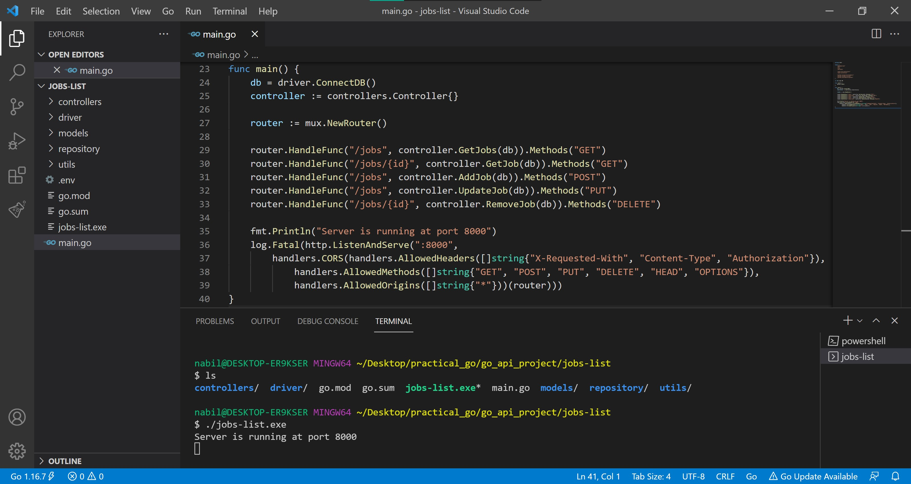

# Jobs REST API

[](https://opensource.org/licenses/MIT)


## Overview

This project implements a RESTful API using Go (Golang) that manages job-related data through CRUD (Create, Read, Update, Delete) operations with PostgreSQL as the backend database. 

### Key Features
- Data modeling using Go structs and slices for efficient data manipulation
- API endpoint routing and handler function implementation
- Modular and maintainable code architecture
- Integration with PostgreSQL for persistent data storage

### Technical Implementation
The API leverages several key technologies and packages:
- gorilla/mux for robust routing capabilities
- Environment variable management
- HTTP request handling
- JSON encoding/decoding
- Type checking and string conversion utilities

### Tech Stack
- Go (Golang)
- PostgreSQL
- Postman (API testing)

This REST API serves as a practical demonstration of building scalable web services with Go while following best practices in API design and database integration.

## Environment Setup

### Prerequisites
1. **Go (Golang)**
   - Download and install from [Go's official website](https://go.dev/doc/install)

2. **Required Go Packages**
   ```bash
   go get github.com/gorilla/mux      # HTTP router and URL matcher
   go get github.com/subosito/gotenv  # Environment variable loader
   go get github.com/lib/pq           # PostgreSQL driver
   ```

3. **Postman**
   - Install [Postman](https://www.postman.com/) for API testing and development

4. **Database Setup**
   - Create a free database instance on [ElephantSQL](https://www.elephantsql.com/)
   - Execute the following SQL to create the jobs table:
     ```sql
     CREATE TABLE jobs (
         # Table schema here
     );
     ```

### Configuration
Create a `.env` file in your project root with the following:
```env
ELEPHANTSQL_URL="your_database_url_here"
```

With these components in place, you'll have a complete development environment for running and testing the API.

## Run Application

To start and test the application:

### 1. Build and Run

Launch the application by running the following command in your terminal:

```bash
go build && ./jobs-list
```

### 2. Access the API

You can access the API in two ways:

#### Browser
Open your web browser and navigate to:
```
http://localhost:8000/jobs
```

#### Postman
Alternatively, use Postman to send requests:
```http
GET http://localhost:8000/jobs
```

Note: The application runs on port 8000 by default. Make sure this port is available on your system.


## Examples

We recommend using Postman to make requests to the REST API. You can use either the desktop agent or browser version to send GET, POST, PUT, or DELETE requests.

### Create a Job

To create a new job posting:

```http
POST http://localhost:8000/jobs
```

Request body:
```json
{
    "title": "Software Engineer",
    "company": "LLM AI",
    "location": "San Francisco, CA",
    "type": "Full-time"
}
```

The server will return a response containing the newly created job's ID (assumed to be 8 in subsequent examples).

### Read Jobs

To retrieve all jobs:

```http
GET http://localhost:8000/jobs
```

To retrieve a specific job by ID:

```http
GET http://localhost:8000/jobs/1
```

### Update a Job

To update an existing job:

```http
PUT http://localhost:8000/jobs
```

Request body:
```json
{
    "id": 8,
    "title": "Machine Learning Engineer",
    "company": "LLM AI",
    "location": "New York, NY",
    "type": "Full-time"
}
```

### Delete a Job

To delete a job by ID:

```http
DELETE http://localhost:8000/jobs/8
```

For more detailed examples of using our API with Postman, check out our [demo](https://github.com/nabilshadman/go-rest-api-jobs-list-postgres/tree/main/demo).


## Screenshots

Visual walkthrough of the API's core functionality:

<table>
<tr>
  <td width="50%">
    <br/>
    <em>1. Server running on localhost:8000</em>
  </td>
  <td width="50%">
    <br/>
    <em>2. GET /jobs - Retrieving all jobs</em>
  </td>
</tr>
<tr>
  <td width="50%">
    <br/>
    <em>3. GET /jobs/{id} - Retrieving specific job</em>
  </td>
  <td width="50%">
    <br/>
    <em>4. POST /jobs - Creating new job</em>
  </td>
</tr>
<tr>
  <td width="50%">
    <br/>
    <em>5. Server response for job creation</em>
  </td>
  <td width="50%">
    <br/>
    <em>6. PUT /jobs - Updating existing job</em>
  </td>
</tr>
<tr>
  <td width="50%">
    <br/>
    <em>7. Server response for job update</em>
  </td>
  <td width="50%">
    <br/>
    <em>8. DELETE /jobs/{id} - Removing job</em>
  </td>
</tr>
<tr>
  <td width="50%">
    <br/>
    <em>9. Server response for job deletion</em>
  </td>
  <td width="50%">
    <br/>
    <em>10. Final PostgreSQL database state</em>
  </td>
</tr>
</table>


## Contributing

Contributions are welcome! Please feel free to submit a Pull Request. For major changes, please open an issue first to discuss what you would like to change.

## License

This project is licensed under the MIT License. See the [LICENSE](./LICENSE.txt) file for details.

## Citation  
If you use this work in your research, please cite:  

```bibtex  
@misc{jobs-rest-api,
  author = {Shadman, Nabil},
  title = {Jobs REST API with Go and PostgreSQL},
  year = {2021},
  publisher = {GitHub},
  url = {https://github.com/nabilshadman/go-rest-api-jobs-list-postgres}
}
```
